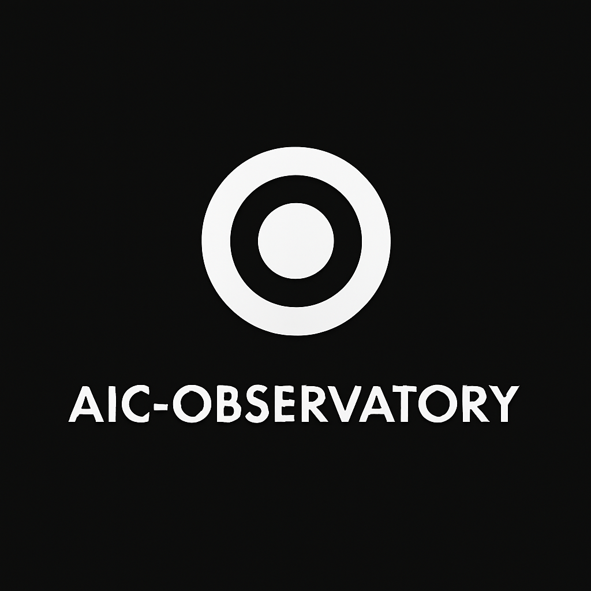

# AIC-Observatory
**Civilization Intelligence Infrastructure**

<p align="center">
  
</p>

> AIC/HMN is licensed under GPL-3.0. Any fork or derivative work must keep the same license and respect the core principles: zero-donation, third path independence, and ethical-from-kernel. The project is currently maintained by the founder. During the founder’s mandatory military service (expected 2027–2029), the project will enter maintenance mode. All code remains public and transparent.”

---

AIC Observatory is an open infrastructure designed to monitor and analyze large-scale signals shaping human civilization.
The system focuses on **technology evolution, societal meaning dynamics, and systemic risks**, while strictly respecting privacy and ethical constraints.

The project is part of the **Adaptive Intelligence Circle (AIC)** ecosystem and aligns with the values of the **Human Meaning Network (HMN)**.

Unlike traditional surveillance systems, AIC Observatory analyzes **system-level patterns rather than individual behavior**.

---

# Vision

Modern civilization is experiencing unprecedented acceleration driven by:

* Artificial Intelligence
* Open-source technology ecosystems
* Compute concentration
* Information and attention economies

At the same time, societies face increasing risks such as:

* cognitive manipulation
* attention fragmentation
* meaning crises
* technological systemic risks

AIC Observatory aims to build an **open intelligence infrastructure** capable of:

* detecting weak signals
* modeling civilization-scale trends
* simulating possible futures
* supporting responsible decision-making

---

# Core Principles

1. **Civilization Awareness**

   The system observes large-scale patterns affecting humanity rather than tracking individuals.

2. **Privacy by Design**

   AIC Observatory does not collect or process personal data.

3. **Open Knowledge Infrastructure**

   All models, signals, and analysis pipelines are designed to be open and transparent.

4. **Ethical Governance**

   Governance mechanisms ensure responsible research and prevent misuse.

5. **Human Meaning Preservation**

   Technology development should support human flourishing rather than degrade cognitive or social systems.

---

# Architecture

```pgsql
AIC-Observatory
│
├── signal_layer
│   ├── tech_signals
│   ├── social_signals
│   ├── research_signals
│   └── economic_signals
│
├── pattern_detection
│   ├── weak_signal_detector
│   ├── anomaly_detection
│   └── trend_extraction
│
├── civilization_models
│   ├── tech_acceleration_model
│   ├── meaning_crisis_model
│   ├── cognitive_influence_model
│   └── systemic_risk_model
│
├── simulation
│   ├── future_scenarios
│   ├── collapse_simulation
│   └── intervention_testing
│
├── governance
│   ├── privacy_guard
│   ├── transparency
│   └── ethics
│
└── reports
    ├── civilization_dashboard
    ├── risk_alerts
    └── foresight_briefs
```

---

# Key Capabilities

### Signal Monitoring

Observe signals related to:

* AI development
* open-source ecosystems
* compute infrastructure
* information ecosystems
* economic dynamics

### Pattern Detection

Detect:

* weak signals
* anomalies
* long-term trends

### Civilization Modeling

Develop models to analyze:

* technological acceleration
* meaning and cognition dynamics
* systemic risks

### Strategic Simulation

Run simulations for:

* technology futures
* systemic collapse scenarios
* policy interventions

---

# Example Outputs

### Civilization Dashboard

Example indicators:

* AI Acceleration Index
* Compute Concentration Risk
* Meaning Stability Index
* Cognitive Manipulation Risk

### Risk Alerts

Example:

AI-generated propaganda acceleration detected
Confidence: Medium
Time Horizon: 12 months

### Foresight Briefs

Research-style reports analyzing long-term systemic risks and technology trajectories.

---

# Governance

AIC Observatory includes a governance framework to ensure responsible development:

* transparency mechanisms
* ethical review
* privacy safeguards
* misuse prevention

See:

* `CODE_OF_CONDUCT.md`
* `SECURITY.md`
* `GOVERNANCE/`

---

# Contributing

We welcome contributions from researchers, engineers, and analysts interested in:

* AI safety
* systemic risk modeling
* data infrastructure
* social science research
* governance frameworks

See `CONTRIBUTING.md` for details.

---

# License

This project is licensed under the GNU License.

---

# Long-Term Goal

AIC Observatory aims to become a **global open infrastructure for civilization awareness**, enabling researchers, policymakers, and communities to better understand emerging systemic risks and opportunities.
